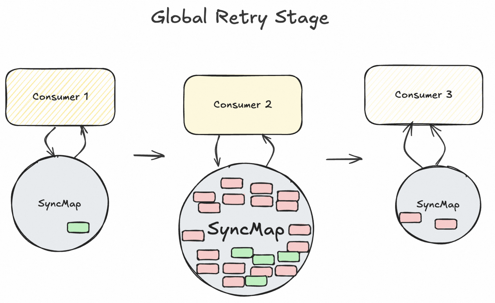
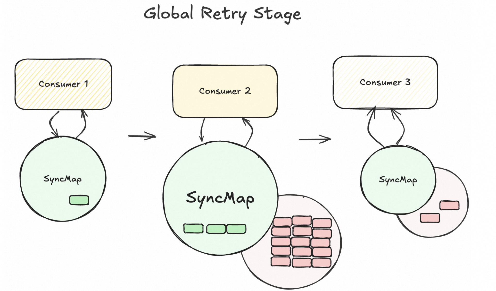
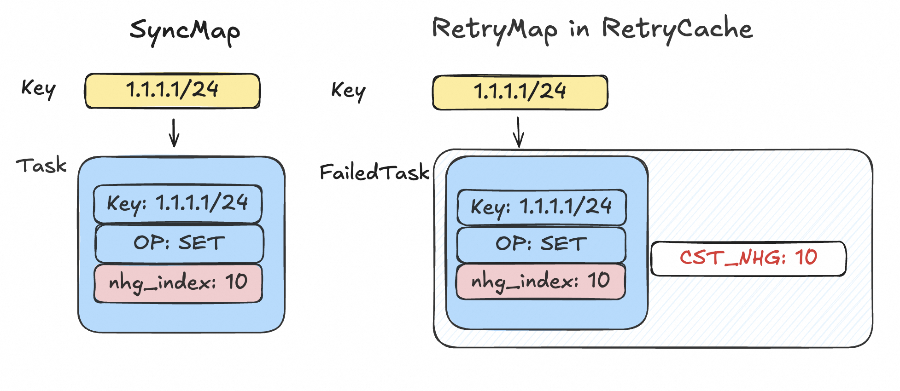
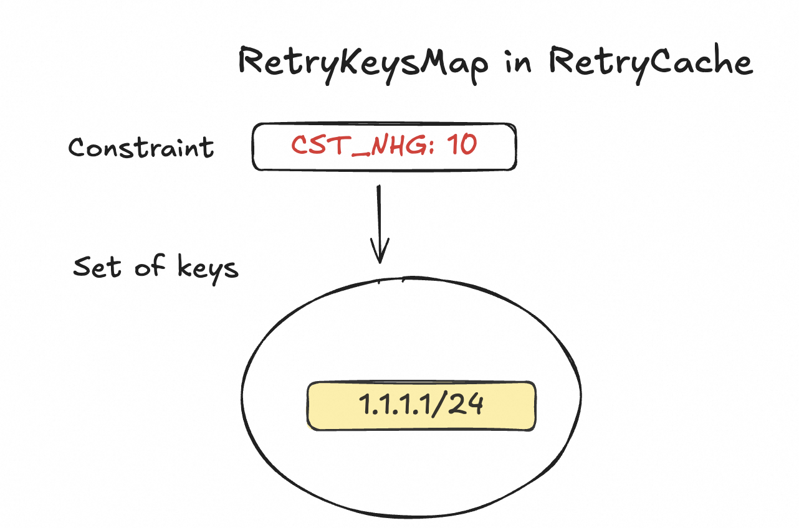
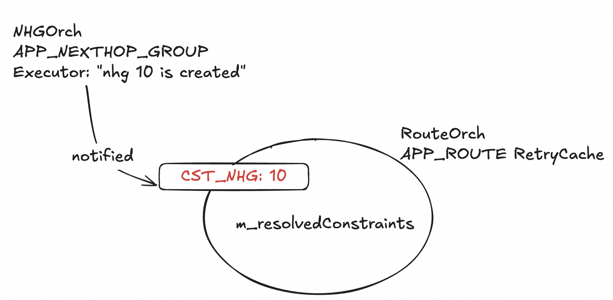

<!-- omit in toc -->
# Failure Handling with RetryCache

<!-- omit in toc -->
## Revision

| Rev |   Date     |     Author      |   Change  Description     |
|:---:|:----------:|:---------------:|:-------------------------:|
| 1.0 | 10/03/2024 |   Yijiao Qin    |    Base version           |
<!-- | 1.1 | 09/26/2025 |   Yijiao Qin    |   Adopt multi-map SyncMap | -->

<!-- omit in toc -->
## Table of Contents

- [Overview](#overview)
- [Terminology](#terminology)
- [Problem Statement](#problem-statement)
- [Requirements](#requirements)
- [Optimized Retry Logic with RetryCache](#optimized-retry-logic-with-retrycache)
  - [RetryCache](#retrycache)
    - [On-demand Allocation](#on-demand-allocation)
  - [Constraint](#constraint)
  - [FailedTask](#failedtask)
  - [RetryMap](#retrymap)
  - [Group failures by the constraint](#group-failures-by-the-constraint)
  - [Notifications](#notifications)
  - [Restore to SyncMap during global retry process](#restore-to-syncmap-during-global-retry-process)
- [Logging](#logging)
- [Test Results](#test-results)
  - [Check whether the duration of retry decreases](#check-whether-the-duration-of-retry-decreases)
  - [Check the CPU business](#check-the-cpu-business)

## Overview

This doc introduces the implementation of `RetryCache` in sonic-swss module.

This feature optimizes the retry logic of consumer instances when they fail to sync data. The main idea is to analyze the reason of why the task fails, and if it's due to some unsatisfied pre-requisite conditions, we would rather archive it until the constraint gets resolved.

By archiving this kind of failed task into the so-called retry cache, the ochdaemon would not process it during the retry stage.

From the coding perspective, we limit our scope to instances of `ConsumerBase`, which stores pending tasks in a `SyncMap`.

## Terminology

|       Terms              |                  Description                                    |
| ------------------------ | --------------------------------------------------------------- |
| ARP                      | Address Resolution Protocol                                     |
| BGP                      | Border Gateway Protocol                                         |
| MAC                      | Media Access Control                                            |
| SAI                      | Switch Abstraction Interface                                    |
| SWSS                     | Switch State Service                                            |
| SyncMap                  | An multi-map instance variable in Customer                      |
| Consumer                 | An executor in SWSS that process tasks for a specific redis table|
| Orchagent                | The orchestration agent for a group of consumers                |

## Problem Statement

Consider a use case when millions of BGP routes are learnt in the control plane and sent to swss module for processing, and the orchagent needs to validate a route before installing it into the dataplane.

For example, it may check whether the outgoing interface of the route actually exists. The check could fail due to a lot of random factors, for example, there could be some timing issue and the interface creation is not yet completed by SAI, hence can't be detected by swss, or there may be some misconfiguration for the interface.

Another example is the next hop check, it checks whether the next hop referred by the route is valid, which could also fail when ARP service fails to resolve the mac address for the destination ip. When these tasks fail, they would not be discarded, but stay where they are (SyncMap), waiting for the next try. They would finally go through when their constraints are resolved, for example, ARP service finally resolves the mac, or the device gets created by SAI, in the future.


Currently all the pending tasks are retried without differentiation. For each incoming event, after it gets processed, a round of global retry for all consumers gets triggered. Consumers execute all the pending tasks in their SyncMap. This design could help in some scenario, for example, a previously unrecognized interface could have been created by SAI at the time, and gets activated in this retry process.

But this design could bring problems when the failing routes are scaled and stuck in SyncMap.


Consider when several events happen before constraints are resolved, these millions of routes which are stuck in SyncMap would be retried many times. It's such heavy workload and takes many cpu cycles but actually makes no sense since they would not succeed at all due to the existing constraints.

Not only computation resources are wasted, the incoming events are also blocked since they need to wait for the retry in the previous loop to finish.

## Requirements

Based on the problem stated above, we call for a more sophiscated retry logic, which skips unnecessary retries if they have no chance to succeed.

To achieve this, the orchagent should be able to analyze the failures, determine what its constraint is, track this unsatisfied constraint and make immediate notifications when it gets resolved. It determines one constraint at a time, even though there could be several constraints failing that task.

It should archive the failed tasks, remove them from the `SyncMap`, hence the global retry process would not process them.


Those failed tasks, whose constraints are not determined, are still left in `SyncMap`, following the original retry logic.

Use the stated problem above for example, we want to avoid retrying processing those millions of routes before their outgoing interfaces and mac addresse are resolved. We want to retry these routes immediately when their constraints are resolved.

Summary:

- The system should be robust inserting scaled routes
  - should not affect the normal workflow due to prolonged retry
- Limit the upper bound of duration
  - skip retrying with constraints not yet resolved
    - save CPU cycles
  - throttle the retry for those whose constraints already been resolved
    - avoid starvation
- Detect specific constraints which are predefined
  - identify the constraint for a specific failed task
  - archive them with contexts, for easy restoration
  - identify when the constraint gets resolved
  - make in-time notification of constraint resolution
  - do readable logging for debugging

## Optimized Retry Logic with RetryCache

### RetryCache

defined in retrycache.h, an abstraction unit, that groups all new objects defined below

- if allocated one, a consumer can use its `RetryCache` instance, instead of `SyncMap`, to store specific failed tasks
- implements O(1) task query
- implements O(1) look-up for impacted tasks of a certain constraint
- implements O(1) deletion of a stale task
- decouples cst resolution notification and actual retry workload

#### On-demand Allocation

To enable `RetryCache` for a specific consumer, the orchagent should explicitly allocate one for it, and maintains a map to query each `RetryCache` instance by the consumer name.

### Constraint

When a task fails, it's important to identify the reason, a.k.a. the constraint that blocks it.

Developers should be able to represent a specific constraint with a type and a value.

Hence we introduced 3 concepts defined in `retrycache.h`:

- `enum ConstraintType`
- `ConstraintData`
- `Constraint`
  - a pair of `ConstraintType` and `ConstraintData`
  - e.g. `(CST_NHG, "10")` represents the constraint of missing next hop group 10. If a pending route fails in the validation because it refers to the nonexisting next hop group 10, we say it's constraint by `(CST_NHG, "10")`.

Developers could extend `enum ConstraintType` and add more kinds of constraints for special handling. The value of the constraint should be deterministic and obtained directly from the context.

Periodic retries are more suitable when we kind of have no idea when the tasks can succeed, and polling for constraint resolution would be necessary. While for constraints such as missing nhg, it's only resolved when nhgorch performs some creation, hence it's better for pushing the resolution.

In the current design, nhgorch notifies the subscribed consumers each time it creates a new nhg, not only for "nhg 10". Consumers need to decide whether the nhg is the expected one and ignore unrelated notifications.

### FailedTask

When a failed task is archived, it should remember why it fails.

Hence we define `FailedTask`, which combines the constraint and the task itself in a pair.

  

### RetryMap

`SyncMap` is an internal store of a consumer, which stores all the pending tasks, in the form of a multi-map.

Consumers could quickly access `Task` by querying the key.

Now we want to remove the failed tasks with known constraints from `SyncMap`.

Hence `RetryMap` is introduced, it's also a multi-map but maps to `FailedTask`. When a `Task` fails due to a defined constraint, it gets erased from `SyncMap` and added into `RetryMap` together with its cst.

With `RetryMap`, we can

- access the task and its constraint in O(1) by key
- delete a task in O(1) by key



***New Behavior of Failure Handling:***

- construct a constraint with the predefined type and value from the context
- construct a `FailedTask` and insert it into RetryMap
- delete the task from SyncMap

### Group failures by the constraint

To quickly find all affected tasks when notified of a constraint being resolved, we need to maintain a mapping from a specific constraint to its blocked tasks.



### Notifications

Developers should find all the places where the constraint could be resolved.

For example, an nhg missing related constraint could only be resolved when `nhgorch` creates a new next hop group. `nhgorch` has no idea about which nhg is needed by others, so it notifies on every successful nhg installment to the route table consumer.

The route table consumer receives the notifications, checks whether there are tasks affected by this constraint. If no, it ignores this notification. Otherwise, it adds this constraint into RetryCache's `m_resolvedConstraints`.



However, it only marks the constraint as resolved, no retry is performed right now, since it's still in nhg executor's execution stage. (Don't mess it.)

### Restore to SyncMap during global retry process

***Original:*** All the consumers execute pending tasks in `SyncMap` one by one.

***New:*** All consumers firstly restore ready tasks from RetryMap back to SyncMap, then performs the original process.

To avoid blocking, it's supported to configure a threshold [30k] for how many tasks can be moved back to SyncMap in a single run.

- Below attached the logs of installing 800k routes referring to nhg 102 with nhg 102 missing.
- These routes get retried after nhgorch installs nhg 102.
- `routeorch` retries 30k routes in the retry stage of each iteration.
- Only the ExecutableTimer instance gets selected every 1 second, hence the retry stage happens about once per second, we coud thus see routes are retried every 1 second.

```c++
2024-09-30.23:56:27.579214| (RETRY_CST_NHG, 102) resolution notified -> 800000 tasks
2024-09-30.23:56:27.600488| (RETRY_CST_NHG, 102) | ROUTE_TABLE | 30000 retried
2024-09-30.23:56:29.189674| (RETRY_CST_NHG, 102) | ROUTE_TABLE | 30000 retried
2024-09-30.23:56:30.184353| (RETRY_CST_NHG, 102) | ROUTE_TABLE | 30000 retried
2024-09-30.23:56:31.177945| (RETRY_CST_NHG, 102) | ROUTE_TABLE | 30000 retried
2024-09-30.23:56:32.034060| (RETRY_CST_NHG, 102) | ROUTE_TABLE | 30000 retried
2024-09-30.23:56:32.914382| (RETRY_CST_NHG, 102) | ROUTE_TABLE | 30000 retried
2024-09-30.23:56:34.055416| (RETRY_CST_NHG, 102) | ROUTE_TABLE | 30000 retried
2024-09-30.23:56:34.949810| (RETRY_CST_NHG, 102) | ROUTE_TABLE | 30000 retried
2024-09-30.23:56:35.857533| (RETRY_CST_NHG, 102) | ROUTE_TABLE | 30000 retried
2024-09-30.23:56:36.822628| (RETRY_CST_NHG, 102) | ROUTE_TABLE | 30000 retried
2024-09-30.23:56:37.745675| (RETRY_CST_NHG, 102) | ROUTE_TABLE | 30000 retried
2024-09-30.23:56:38.720946| (RETRY_CST_NHG, 102) | ROUTE_TABLE | 30000 retried
2024-09-30.23:56:39.855677| (RETRY_CST_NHG, 102) | ROUTE_TABLE | 30000 retried
2024-09-30.23:56:40.803662| (RETRY_CST_NHG, 102) | ROUTE_TABLE | 30000 retried
2024-09-30.23:56:42.035631| (RETRY_CST_NHG, 102) | ROUTE_TABLE | 30000 retried
2024-09-30.23:56:43.004442| (RETRY_CST_NHG, 102) | ROUTE_TABLE | 30000 retried
2024-09-30.23:56:43.968165| (RETRY_CST_NHG, 102) | ROUTE_TABLE | 30000 retried
2024-09-30.23:56:44.928843| (RETRY_CST_NHG, 102) | ROUTE_TABLE | 30000 retried
2024-09-30.23:56:45.886013| (RETRY_CST_NHG, 102) | ROUTE_TABLE | 30000 retried
2024-09-30.23:56:47.374204| (RETRY_CST_NHG, 102) | ROUTE_TABLE | 30000 retried
2024-09-30.23:56:48.440001| (RETRY_CST_NHG, 102) | ROUTE_TABLE | 30000 retried
2024-09-30.23:56:49.626867| (RETRY_CST_NHG, 102) | ROUTE_TABLE | 30000 retried
2024-09-30.23:56:50.644571| (RETRY_CST_NHG, 102) | ROUTE_TABLE | 30000 retried
2024-09-30.23:56:51.682208| (RETRY_CST_NHG, 102) | ROUTE_TABLE | 30000 retried
2024-09-30.23:56:52.697740| (RETRY_CST_NHG, 102) | ROUTE_TABLE | 30000 retried
2024-09-30.23:56:53.779511| (RETRY_CST_NHG, 102) | ROUTE_TABLE | 30000 retried
2024-09-30.23:56:54.852819| (RETRY_CST_NHG, 102) | ROUTE_TABLE | 20000 retried
```

## Logging

We want to track the moving of tasks

- `++++` means being moved into retry cache
- `----` means being moved out of retry cache

Compared with `swss.rec`, each record in `retry.rec` have a timestamp and direction field before the tuple field.

```bash
root@HOST:/var/log/swss# cat retry.rec | grep 5.5.78.31/32   

2024-09-11.18:55:38.383953| ++++ |ROUTE_TABLE:5.5.78.31/32|SET|nexthop_group:1                                                         
2024-09-11.18:56:22.144220| ---- |ROUTE_TABLE:5.5.78.31/32|SET|nexthop_group:1
```

## Test Results

### Check whether the duration of retry decreases

1. Insert 40k routes referring to a non-existent nhg, which would keep retrying but never succeed

2. Delete a non-existent next hop group, which makes `NEXTHOP_GROUP_TABLE` to be selected and triggers all executors retrying

3. Measure the duration of retry stage in `OrchDaemon`'s event loop.

4. Measure the duration of retrying `ROUTE_TABLE` and the size of `m_toSync` before and after retry

Before optimization.

```c++
NEXTHOP_GROUP_TABLE's run: retry stage takes 484 milliseconds!
```

```c++
ROUTE_TABLE retry : 40000 entries -> 40000 entries in m_toSync, takes 468 milliseconds 
```

After optimization:

```c++
NEXTHOP_GROUP_TABLE's run: retry stage takes 6 milliseconds!
```

```c++
ROUTE_TABLE retry : 0 entries -> 0 entries in m_toSync, takes 0 milliseconds 
```

### Check the CPU business

After optimization, the %CPU of orchagent would decrease during retry stage.
