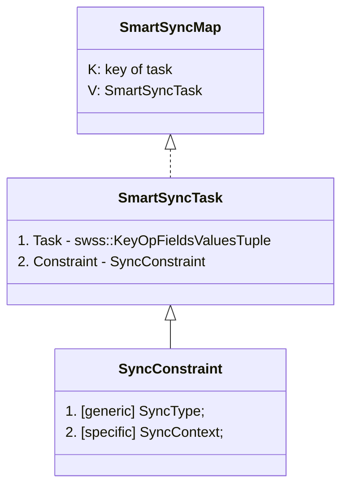
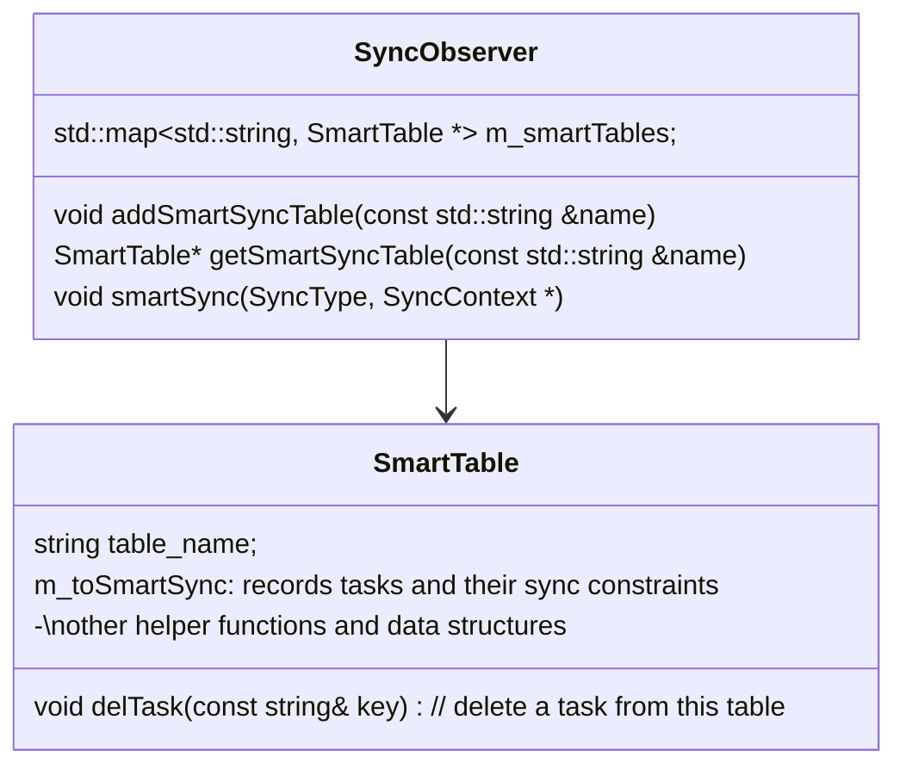

<!-- omit in toc -->
# Postpone Retry - Late Sync for SWSS Consumers

<!-- omit in toc -->
## Revision

| Rev |     Date    |       Author       | Change Description                |
|:---:|:-----------:|:------------------:|-----------------------------------|
| 1.0 | Aug  5 2024 |   Yijiao Qin       |  |

<!-- omit in toc -->
## Table of Contents

- [Overview](#overview)
- [Terminology](#terminology)
  - [Coding Context](#coding-context)
- [Problem Statement](#problem-statement)
  - [General Immediate Retry](#general-immediate-retry)
    - [1. execute() - OrchDaemon selects a specific executor](#1-execute---orchdaemon-selects-a-specific-executor)
    - [2. doTask() - OrchDaemon invokes all executors to retry remaining tasks](#2-dotask---orchdaemon-invokes-all-executors-to-retry-remaining-tasks)
    - [Concerns](#concerns)
    - [Pain Point](#pain-point)
  - [APP\_ROUTE\_TABLE Use Case](#app_route_table-use-case)
    - [First Iteration - Fail Twice](#first-iteration---fail-twice)
    - [Second Iteration - Fail Once](#second-iteration---fail-once)
    - [Third Iteration - Succeed](#third-iteration---succeed)
  - [Consequences](#consequences)
- [New Design](#new-design)
  - [Redesign m\_toSync](#redesign-m_tosync)
    - [m\_toSmartSync](#m_tosmartsync)
  - [Sync Type Scope](#sync-type-scope)
  - [New Class SyncObserver](#new-class-syncobserver)
    - [Quick Access to Smart Tasks by indexing them with keys](#quick-access-to-smart-tasks-by-indexing-them-with-keys)
    - [Quick Access to Affected Keys by indexing them with constraints](#quick-access-to-affected-keys-by-indexing-them-with-constraints)
  - [RouteOrch with NHG Missing Example](#routeorch-with-nhg-missing-example)
  - [Monitoring](#monitoring)
  - [Impact on other logic](#impact-on-other-logic)
- [Test](#test)

## Overview

This doc talks about our redesigned retry logic of SWSS consumers, instead of retrying all failed tasks pending in the buffer, we check constraints and skip those tasks that would definitely fail again.

## Terminology

|       Terms              |                  Description            |
| ------------------------ | --------------------------------------- |
| SWSS                     | SWitch State Service                    |

### Coding Context

Each swss consumer monitors its subscribed tables, when new data are published, it pops the table to get new tasks.

```h
typedef std::pair<std::string, std::string> FieldValueTuple;
typedef std::tuple<std::string, std::string, std::vector<FieldValueTuple>> KeyOpFieldsValuesTuple;
```

A task is represented by a 3-element tuple `swss::KeyOpFieldsValuesTuple`

- `Key`: the key to be modified
- `Op` :  operation
- `FV` tuples: a vector of `(field, value)` pairs of the key

The consumer also builds an index for each task with its `Key` and stores the indexed task in its member field `m_toSync`.

```h
typedef std::map<std::string, swss::KeyOpFieldsValuesTuple> SyncMap;
SyncMap ConsumerBase::m_toSync;
```

`m_toSync` is an `SyncMap` which maps a modified key to its specific task, consumers could distinguish tasks with the key to avoid duplicate tasks and collapse multiple tasks about the same key.

## Problem Statement

### General Immediate Retry

The code snippet below is about OrchDaemon's event loop after it's started.

```c++
while (true) 
{
    Selectable *s;
    int ret = m_select->select(&s, SELECT_TIMEOUT);
  
    // ...ignored (error/timeout/flush handling)

    auto *c = (Executor *)s;
    c->execute();

    for (Orch *o : m_orchList)
      o->doTask(); 
}
```

#### 1. execute() - OrchDaemon selects a specific executor

`Orchdaemon` selects an executor who has new tasks and highest priority to execute its tasks in 3 steps

1. pops - read tasks from the subscribed table
2. addToSync - store tasks into `m_toSync`
3. drain - trigger `doTask(Consumer& consumer)` to iterate over `m_toSync` to process tasks
   1. On success – erase the task from `m_toSync`
   2. On failure – continue

After it finishes execution, only failed tasks are left in its `m_toSync`.

#### 2. doTask() - OrchDaemon invokes all executors to retry remaining tasks

Then `Orchdaemon` loops over all its orch instances with `doTask()`. All failed tasks in the system get retried here.

#### Concerns

1. With too many failed tasks to retry, the OrchDaemon main thread gets blocked.
2. It wastes CPU cycles if the retry doesn't make sense and fail again after taking a long time.

#### Pain Point

1. We want to reduce the number of tasks to retry
   1. postpone the unnecessary retry to sync it later
2. We want to determine
   1. what kinds of retry are unnecessary
   2. when to retry the postponed failed tasks

### APP_ROUTE_TABLE Use Case

Common reasons for route insertion failure:

- Event orders: route insertion tasks arrive before next hop insertion tasks
- Insufficient Hardware Resources for ROUTE_TABLE, ECMP, etc.
- Missing ARP, VPN, TE contexts, etc.

Take event order case for example -

#### First Iteration - Fail Twice

In the first iteration, `OrchDaemon` selects the consumer of `APP_ROUTE_TABLE` to execute new tasks. However, these route insertion tasks all fail due to lack of next hops. Hence, they are left in `m_toSync`.

Then comes `Orchdaemon` iterating all executors to retry tasks. The previously failed tasks are executed for the second time, but fail again since next hops are still not provided.

#### Second Iteration - Fail Once

In the second iteration, although `NEXTHOP_GROUP_TABLE` is ready with new tasks, it's not guaranteed to be selected, since there can be other executors ready and have higher priority. If `Orchdaemon` selects the other executor, after its execution, all failed route tasks would get retried in the global retry, but would fail again. The route tasks could only succeed after the `NEXTHOP_GROUP_TABLE` consumer is selected and executed. Otherwise, all the retry doesn't make sense. If there are a lot of route insertion tasks, these retry would block the workflow.

#### Third Iteration - Succeed

In the second iteration, let's assume there is no higher-priority executor ready, the consumer for `NEXTHOP_GROUP_TABLE` gets selected to execute tasks and set up next hop information. After the execution, route insertion tasks are retried in the global retry stage, and they finally succeed.

### Consequences

Route tasks could be scaled. If they are retried by `OrchDaemon` in every iteration and the executor who has the dependent tasks isn't selected to execute. Those scaled route tasks would get executed for at least 3 times, which may delay the queuing executors' execution, which may further delay the route insertion success itself, and trigger route timeout logic of other applications. We should try to avoid the must-fail retry, and wait until the constraints to be satisfied.

In this example, we should disable route insertion retries until next hop information is added.

## New Design

### Redesign m_toSync

Original `m_toSync` stores all tasks for the executor to sync, without distinguishing them
  
- some tasks are newly added, some are the failed ones left by the previous run
- some failed tasks could be succeeded by an extra sync
- some failed tasks have constraints not met, and would not succeed until the constraints are solved, any extra sync before this would be meaningless. Hence these failures need a smarter sync strategy.
  
#### m_toSmartSync
  
- after a run of execution, `m_toSync` only stores failed tasks which are meant for immediate retry by `OrchDaemon`
  - delete those failed tasks whose retry would be postponed, in `m_toSmartSync` instead
  - `OrchDaemon` only resyncs entries in  `m_toSync`, not `m_toSmartSync`, which saves CPU cycles

- `m_toSync` maps the key to a task represented by `swss::KeyOpFieldsValuesTuple`
  - `m_toSmartSync` maps the key to a smart task
  - smart: pair the original task with its constraint for sync

```h
typedef swss::KeyOpFieldsValuesTuple SyncTask;
typedef std::map<std::string, SyncTask> SyncMap;
// smart tasks:
typedef std::pair<SyncConstraint*, SyncTask*> SmartSyncTask;
typedef std::map<std::string, SmartSyncTask> SmartSyncMap;
```

### Sync Type Scope

We only do smart sync for several failures defined in `enum SyncType` below, and leave the other failed cases in `m_toSync`.

```h
enum SyncType
{
    SYNC_TYPE_NHG,
    SYNC_TYPE_PIC,
    SYNC_TYPE_NHG_REF,
    SYNC_TYPE_PIC_REF
};

class SyncContext {};
```

Each `SyncType` has corresponding context struct

```h
struct NeighborSyncContext: SyncContext
{
    NeighborEntry entry;
};
```

A type together with a context forms a complete sync constraint.

```h
typedef std::pair<SyncType, SyncContext> SyncConstraint;
```



### New Class SyncObserver

If a specific orch wants to smartsync its tables, it should inherit `SyncObserver`.

```c
class RouteOrch : public Orch, public Subject, public SyncObserver {...}
```



For each table that enables smartsync feature, the orch should create a SmartTable instance for it.

#### Quick Access to Smart Tasks by indexing them with keys

`m_toSmartSync` - provided a task key, we get the task with its sync constraint

#### Quick Access to Affected Keys by indexing them with constraints

`m_syncKeys` - provided a sync constraint, we get the affected task keys

### RouteOrch with NHG Missing Example

```c++
dotask(ConsumerBase& consumer)
{
  SmartTable* table = nullptr;

  if (table_name == APP_ROUTE_TABLE_NAME) {
      SmartTable* table = m_orch->getSmartSyncTable(APP_ROUTE_TABLE_NAME);
  }

  if (!nhg_index.empty())
  {
      try {...}
      catch (const std::out_of_range& e)
      {
          SWSS_LOG_ERROR("Next hop group %s does not exist", nhg_index.c_str());

          if (table) {
            auto constraint = std::shared_pointer<SyncConstraint>(SYNC_TYPE_NHG, NeighborSyncContext{nhg_index});
            table->m_syncKeys[*constraint->get()].insert(it->first);
            auto task = std::shared_pointer<swss::KeyOpFieldsValuesTuple>(it->second);
            table->m_toSmartSync[it->first] = std::make_pair(constraint, task);
            // [New: delete]
            it = consumer.m_toSync.erase(it);
          } else {
            // [Original]
            ++it;
          }
          continue;
      }
  }
}
```

### Monitoring

```c++
struct NeighborSyncContext: SyncContext
{
    NeighborEntry entry;
};

bool NeighOrch::addNeighbor(const NeighborEntry &neighborEntry, const MacAddress &macAddress) {
  ....
  NeighborSyncContext context{ neighborEntry };
  syncNotify(SYNC_TYPE_NHG, &context);
}
```

```c++
void RouteOrch::smartSync(SyncType type, SyncContext * ctx) override
{
    assert(ctx);

    // only APP_ROUTE_TABLE now

    SmartTable* table = getSmartSyncTable(APP_ROUTE_TABLE_NAME);
    SmartSyncMap& m_toSmartSync = table->m_toSmartSync;
    SmartKeyMap& m_syncKeys = table->m_syncKeys;

    switch(type)
    {
        case SYNC_TYPE_NHG:
        {
            NeighborSyncContext * context = static_cast<NeighborSyncContext *>(ctx);
            SyncConstraint constraint = {SYNC_TYPE_NHG, *context};

            if m_syncKeys.find(constraint) != m_syncdKeys.end() {
                std::unordered_set<std::string>& keys = m_syncKeys[constraint];
                for (auto it = keys.begin(); it != keys.end();) {
                    swss::KeyOpFieldsValuesTuple* task = m_toSmartSync[*it].second;
                    addToSync(std::deque<swss::KeyOpFieldsValuesTuple>(*task));
                    it = keys.erase(it);
                    m_toSmartSync.erase(*it);
                }
                m_syncKeys.erase(constraint);
            }
            break;
        }
        default:
            break;
    }
}
```

### Impact on other logic

- `addToSync` checks both `m_toSync` and `m_toSmartSync`
- if entry found in `m_toSmartSync`, call `SmartTable`'s `delTask(key)`

## Test

to be added
